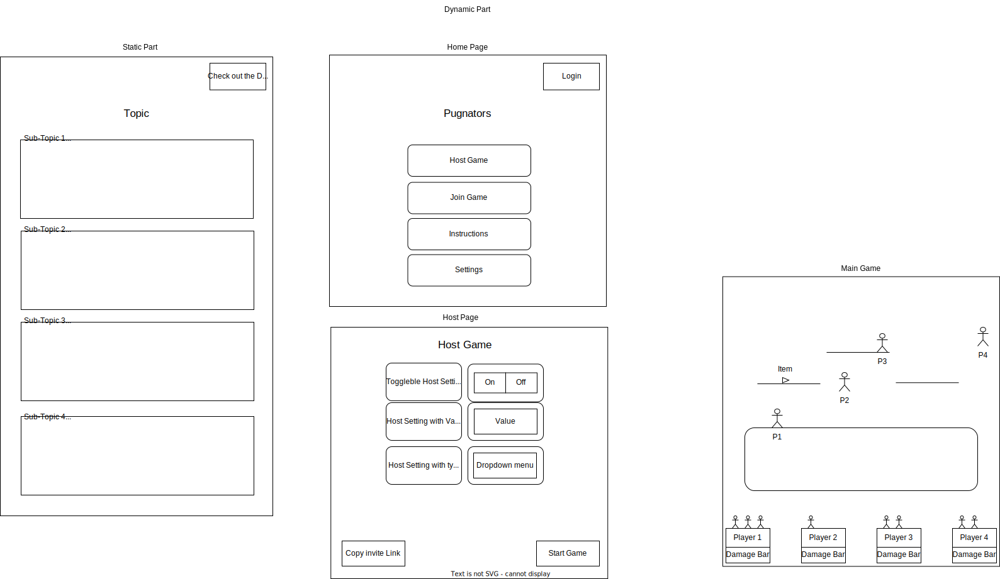

# Project Description

## Static Part

For the static part, we are researching, what makes a good Platform-Fighting-Game. Some, but not all of the points we will research will be:

 1. Gameplay Mechanics

 2. Character Design

 3. Graphics and Animation

 4. Multiplayer and Online Features

 5. Sound and Music

 7. Game Balance and Updates

 8. Accessibility and Learning Curve

By delving into these subtopics, we'll gain a comprehensive understanding of what makes a good platform-fighter and the various elements that contribute to its success.

##### Here is a wireframe diagram, showcasing a sketch for some sites in the project.

 
## Dynamic Part

For the Dynamic Part, our Plan is to create "Pugnators", which is an exciting web game inspired by the popular Super Smash Bros series. This project aims to provide an engaging and entertaining experience for fighting game fans.

### People will be able to...
- Play against bots
- Host Lobbies
- Join public lobbies to meet new People
- Join private lobbies of their friends or classmates with a code

### Hosts of lobbies will be able to...
- Change the lobby visibility (public or private)
- Set the max number of players for their lobby
- Toggle on/off specific characters
- Set the lives for each player
- Set the damage multiplier.
- Control the availability and frequency of power-ups or items
- Toggle on/off the visibility of the scoreboard
- Toggle on/off the Super Meter

### Game Menu
- Players choose their Character
- Players will choose a skin for their chararacter
- Players will choose in what Team they are (if it's a tean match)

### Objective
The primary objective of **Pugnators** is to knock opponents off the stage. Each player starts with an empty knockback meter that increases as they take damage. The more filled the bar, the farther they will be knocked back by attacks.

### Damage System

**Pugnators** uses a damage bar system. If your bar is more filled, it's easier for opponents to knock you off the stage. Players are eliminated temporarily when they are knocked out, and they respawn to continue the battle.

## Items

Throughout the match, items such as weapons, power-ups, and healing items may appear on the stage. Players can pick up these items to gain advantages or disrupt their opponents.

### Multiplayer

The game supports multiplayer modes, allowing friends or players online to join the fun. Matches can be played in free-for-all or team formats, adding a social and competitive element to the gameplay.

## Super Attack

As players deal and receive damage, a **Super Attack** meter fills up. When activated, the **Super Attack** allows a character to unleash a powerful, unique attack that can turn the tide of the battle.

## Team Members
|Person                   | Profession      |
|-------------------------|-----------------|
|Deniz Ciger              | Project Manager |
|Sebastian Schneiderbauer | Project Member  |
|Adrian Pichler           | Project Member  |
|Marcel Gasteiner         | Project Member  |
|Professor David Klewein  | Project Client  |
|Professor Robert Reder   | Project Client  |
